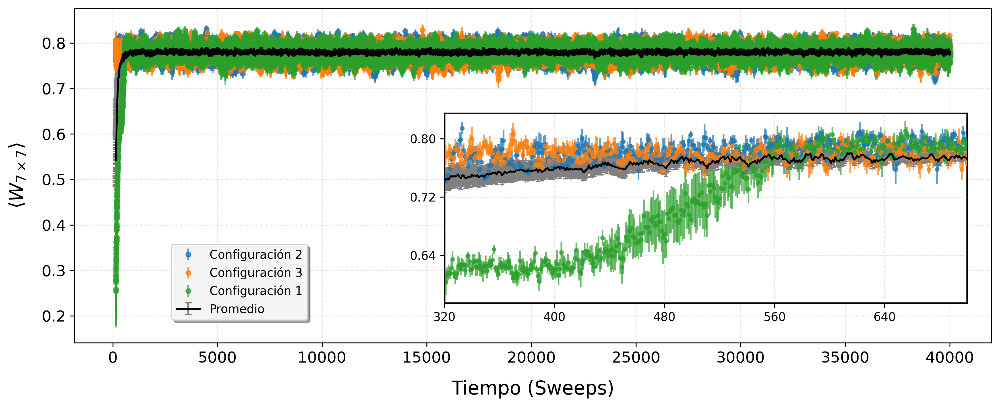
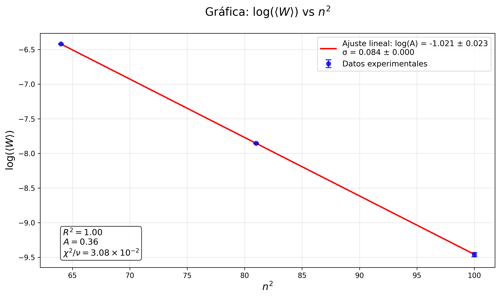
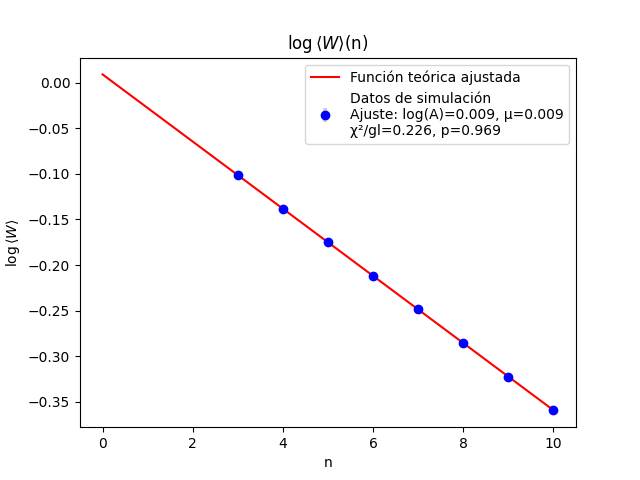
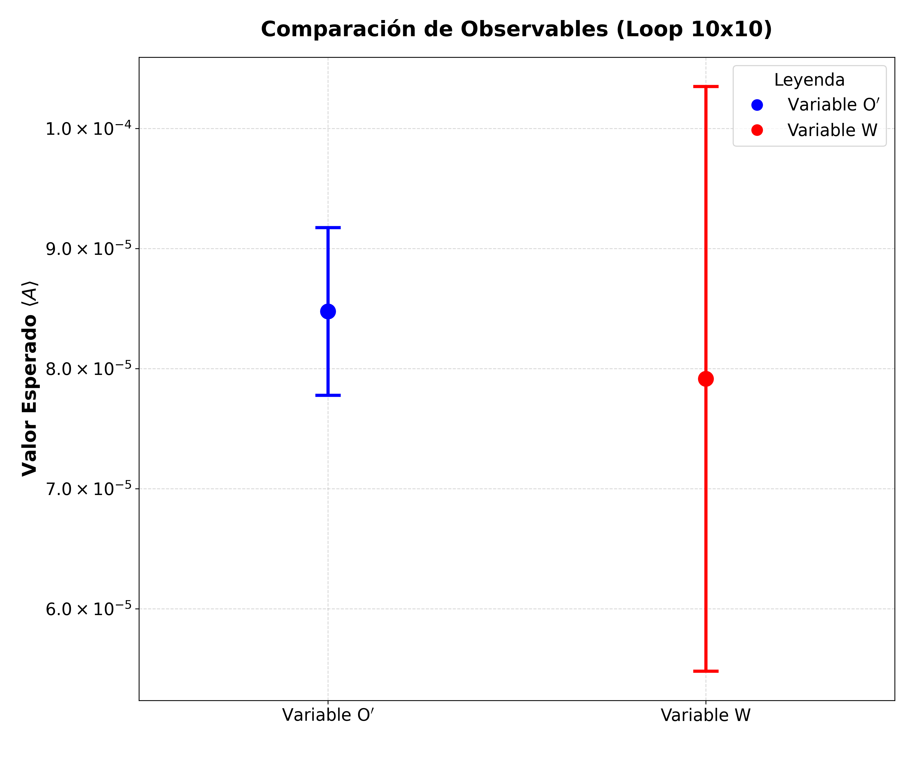

# SIMULACIÓN DE UN SISTEMA ISING-GAUGE 3D 

Curso: 2025/2026
Asignatura: Técnicas Físicas III
Autores:
    - Ignacio Herraiz
    - David Barrachina
    - Joel Gracia

## OBJETIVOS

Este proyecto se divide en dos partes. La primera de ellas es entender el funcionamiento de un
sistema Ising-Gauge en 3 dimensiones, para poder programar un código en C/C++ que nos permita
comprobar dos leyes fundamentales que rigen estos sistemas: la Ley del Área y la Ley del Perímetro.

Después, se trató de definir unas nuevas variables del sistema, que nos permitiesen reproducir de 
nuevo estos resultados pero reduciendo los errores estadísticos.

## MÉTODOLOGÍA

### LEYES DEL ÁREA Y DEL PERÍMETRO

El sistema Ising-Gauge se basa en una red cúbica que asigna un valor +1 o -1 a cada una de las aristasde esta red. Por tanto, si tenemos V vértices en el cubo, tendremos 3V aristas. Codificamos losvalores de las aristas en un array de una dimensión. Implementamos también una función que nos indica cuáles son los vecinos de cada vértice, para poder añadir interacciones entre aristas. Implementamos una gran cantidad de test para comprobar cada una de las funciones que incluíamos, los cuales se pueden encontrar en la carpeta /TESTS. 

La evolución de los valores de las aristas se lleva a cabo mediante una simulación de Monte Carlo, en la que implementamos el algoritmo de Metropolis. Con este algoritmo actualizamos de golpe un 'sweep'(un sweep representa la cantidad total de variables a actualizar). Antes de tomar medidas en elsistema se realiza un proceso de termalización, para que el sistema se encuentre lo más cerca delequilibrio posible.

Para la comprobación de las leyes comentadas, necesitamos calcular el valor de los Wilson loops, paradespués poder hacer promedios estadísticos. Aquí surgen varias preguntas que deben ser resueltasdurante el trabajo: ¿Es mejor hacer un barrido de las aristas secuencial o random? ¿Calculamos todoslos loops o calculamos un número reducido de ellos?...

### NUEVO OBSERVABLE

Definimos un nuevo observable distinto a los Wilson loops, el cual debe permitirnos repetir el mismo análisis de las leyes del área y del perímetro, pero reduciendo los errores estadísticos que obtuvimosen la primera parte.

Adaptamos todas las funciones a esta nueva variable y repetimos el mismo análisis. 

## TECNOLOGÍAS

    - Todos los códigos de la simulación estan escritos en C/C++.
    - Todos los gráficos los obtenemos mediante scripts en Python.

## ESTRUCTURA

    - Tenemos una carpeta de TESTS donde fuimos probando funciones antes de implementarlas en el main.
    - En la carpeta /.vscode tenemos un fichero tasks.json con las posibles acciones: compilar/ejecutar los test, compilar/ejecutar el main...
    - La segunda parte del proyecto se encuentra en la carpeta /Apartado-adicional.

## RESULTADOS

En la primera parte del trabajo, primeramente atajamos las preguntas sobre cual era la forma óptima de llevar a cabo las simulaciones. Vimos que lo mejor era que en el algoritmo de Metropolis hiciesemos un barrido secuencial de las aristas. Además al observar los tiempos de ejecución, nos dimos cuenta que el programa pasaba la mayor parte del tiempo en la dinamica de Metrópolis, en lugar de en el cálculo de los observables. Por tanto, decidimos que lo mejor era calcular la totalidad de los Wilson loops, para así además tener una mejor estadística. 

También, llevamos a cabo un análisis de la correlación temporal, para ver cuánto tiempo tenemos que dejar evolucionar al sistema para obtener medidas independientes unas de otras. Vimos que para la ley del área necesitabamos 25 sweeps y para la del perímetro 20.

En cuanto a la termalización del sistema, vimos que no era necesaria una termalización muy larga, transcurridos unos pocos sweeps, el sistema ya se encontraba cercano al equilibrio.

Además comprobamos tanto la Ley del Área como la Ley del Perímetro. La primera de ellas, vimos como requería una cantidad mucho mayor de datos para ser comprobada, y aun así seguía siendo difícil de observar con los recursos de los que disponemos.

Finalmente, con la nueva variable que hemos definido, las leyes vuelven a verificarse, y los errores se han reducido, en el peor de los casos, en un factor 3.

 

## CONTRIBUCIONES

    - El desarrollo teórico y la validación analítica de la nueva variable fueron llevados a cabo por Ignacio
    - La implementación del código de la primera parte del proyecto, junto con las simulaciones correspondientes, fueron llevadas a cabo por los 3 integrantes indistintamente.
    - La implementación de la segunda parte del proyecto fue llevada a cabo, principalmente por David y Joel.
